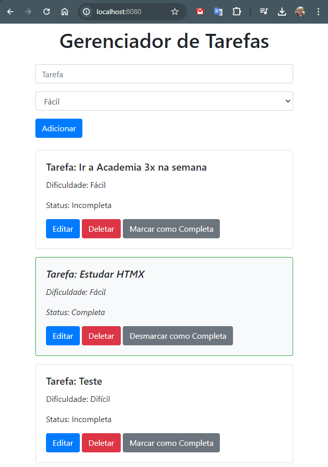

# gerenciador-tarefas-htmx

Sistema de gestão de tarefas desenvolvido para curso de HTMX

## Tecnologias utilizadas

- [NodeJS](https://.nodejs.org)
- Back-end
  - express
  - cors
  - sqlite
  - sequelize
- Front-end
  - [htmx](https://htmx.org/)
  - http-server
  - [bootstrap](https://getbootstrap.com/)

## Como rodar o projeto localmente

### Pré-requisistos

Ter o node instalado na versão 18 ou superior

### Configurando back-end

Após clonar o projeto, no terminal, acesse a pasta da api `\..\gerenciador-tarefas-htmx\api\` e instale as dependências com o comando abaixo.

    $ npm install

Após a instalação das dependências, deixe a API rodando com o comando abaixo:

    $ npm start

A api deverá rodar no seguinte endereço: `http://localhost:3000/`

### Configurando o front-end

Para rodar o front-end como se estivesse no servidor, vamos utilziar o `http-server`, para isso é necessário rodar o seguinte comando.

    $ npm install -g http-server

> não estamos utilizando a extensão live-server neste projeto, pois ele não funcina muito bem com htmx.

Com o `http-server` instalado, basta acessar através do terminal (em um terminal diferente do que está rodando a API) a pasta raiz do projeto, `\..\gerenciador-tarefas-htmx\` e rodar o seguinte comando:

    $ http-server

Assim você poderá acessar projeto no navegador no através da url `http://localhost:8080/`

Se tudo estiver correto ao acessar o sistema você deverá ver uma tela como essa

